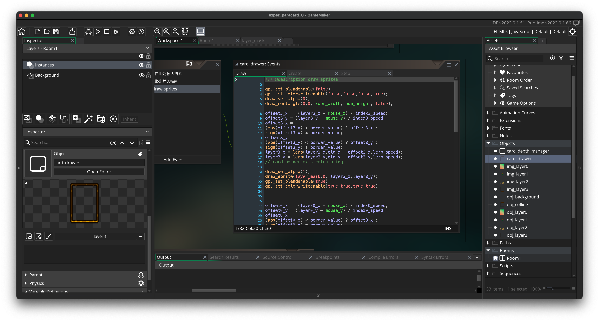

# StereoCard

This is an experimental prototype to test the availability of parallax (stereoscopic effect) cards in game maker studio.

In this prototype, channel masks, parallax effects, and drag and drop were implemented.

---

Itch.io page: [here](https://bowenwang0620.itch.io/stereocard)

Reference for rendering mask:

[Dynamic Rendering Masks - GameMaker](https://gamemaker.io/en/blog/dynamic-rendering-masks)

### Instructions

The card mask and parallax effects are implemented in the `draw` of the object `card_drawer`.
Drag and drop, float effects are implemented in `step`.
Adjust the card position: modify `old_x`, `old_y`

